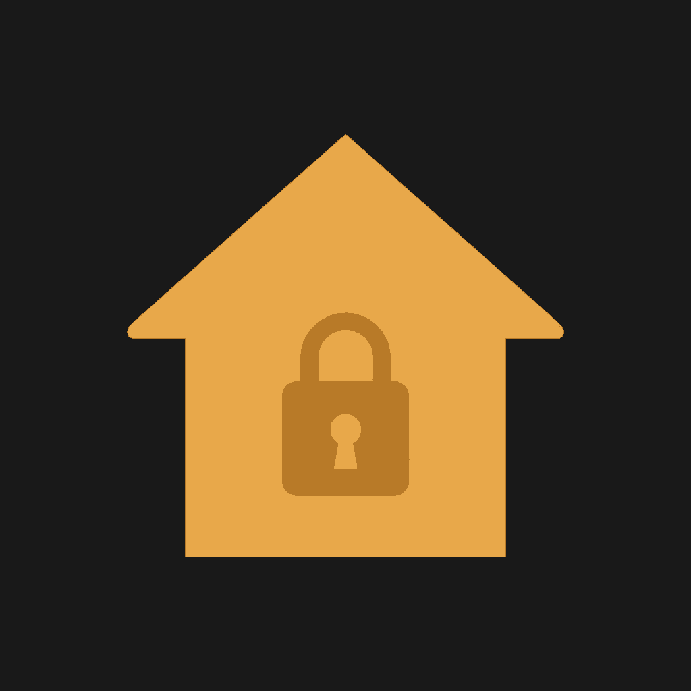

<p align="center">
  
</p>

# HouseArrest

iOS container tool for installed apps: browse files, clean data, and apply `.ha` patches to app containers and App Groups.

Display name: **HouseArrest**  
Bundle ID: `com.apple.mobile.MobileHouseArrest`

## Features

- **Home** — device info and status
- **Apps** — installed third-party apps with name, icon, and container sizes
- **Browse files** — file manager for app data and App Groups
- **Patch** — import a `.ha` package, backup originals, apply, and restore
- **Clean** — documents, caches, and tmp
- **Settings** — light / dark / system appearance and logs

## Package format

`.ha` packages (schema v1), including App Group (`group.*`) targets.

## Build

Open `HouseArrest.xcodeproj` in the latest Xcode, target the latest iOS SDK.

Local unsigned IPA:

```bash
xcodebuild -project HouseArrest.xcodeproj -scheme HouseArrest \
  -configuration Release -sdk iphoneos \
  -destination 'generic/platform=iOS' \
  -derivedDataPath build \
  CODE_SIGNING_ALLOWED=NO CODE_SIGNING_REQUIRED=NO CODE_SIGN_IDENTITY="" build
```

GitHub Actions **Build IPA** is manual only and publishes an unsigned IPA on a draft release.

## App icon

Decoded App Icon lives at:

`HouseArrest/Assets.xcassets/AppIcon.appiconset/AppIcon.png`

If that file is missing after clone:

```bash
base64 -D -i HouseArrest/Assets.xcassets/AppIcon.appiconset/AppIcon.png.b64 \
  -o HouseArrest/Assets.xcassets/AppIcon.appiconset/AppIcon.png
```
